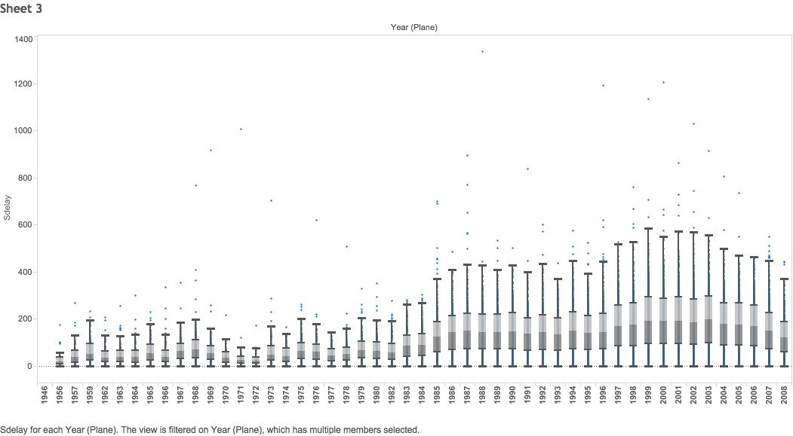

In this R Markdown document we will display and document each step of CS329e R Project 5.

Project Requirements <http://www.cs.utexas.edu/~cannata/dataVis/Projects/Tableau%20Project%202/R%20Project%20Requirements.html>.


In the source folder 01 Data, the R script Access Oracle Database.R was created to connect to Dr. Cannata's Orcale database and generate a data frame from the uploaded ABOVE4CALI.csv and ABOVE4OU.csv files. First the data was pulled using a join SQL query, then the two datasets were piped to ggplot to display the results. The RCurl and jsonlite package were loaded to allow general HTTP requests and process the results returned by the Web server.

```{r}
summary(cars)
```

You can also embed plots, for example:

```{r, echo=FALSE}
plot(cars)
```

Note that the `echo = FALSE` parameter was added to the code chunk to prevent printing of the R code that generated the plot.


vsAge.png)

.png)


