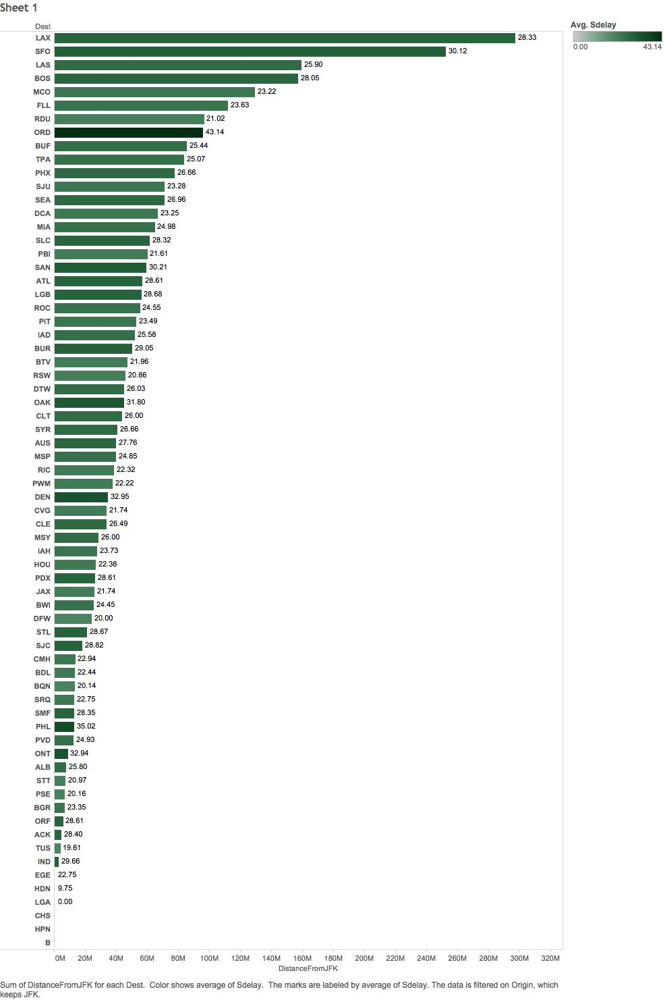

In this R Markdown document we will display and document each step of CS329e R Project 5.

Project Requirements <http://www.cs.utexas.edu/~cannata/dataVis/Projects/Tableau%20Project%202/R%20Project%20Requirements.html>.

The dataset for this project pertains to airline on-time performance for airports throughout United States. To reduce the sheer volume of records, we choose to focus the analysis on data only from JFK. utilizing Tableau to created visualization of the relationships we uncovered.

***Distance vs Average Delay***



***Avg(Delay) vs Age of Aircraft***

vsAge.png)

***Age of Aircraft vs Delay***


***Carrier vs Avg(Delay)***

.png)


***Crosstabs rank()***

```{r}
source("../01 SQL Crosstabs/Rank.R", echo = TRUE)
```

.png)


***Crosstabs last_value()/max_value and difference***

```{r}
source("../01 SQL Crosstabs/lastval_dif.R", echo = TRUE)
```


***Crosstabs nth_value***

```{r}
source("../01 SQL Crosstabs/Nthval.R", echo = TRUE)
```


***Crosstabs cume_dist***

```{r}
source("../01 SQL Crosstabs/cumedist.R", echo = TRUE)
```


